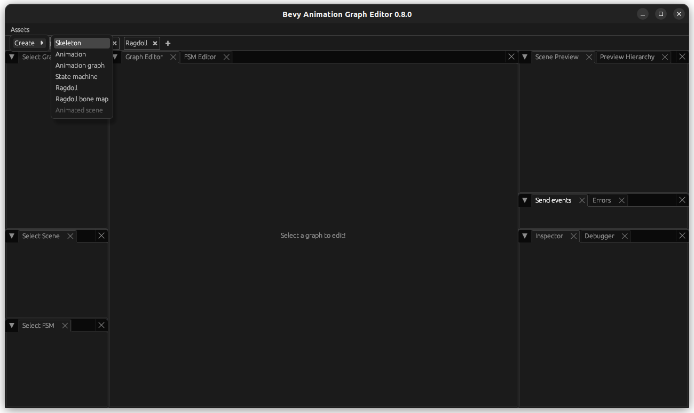
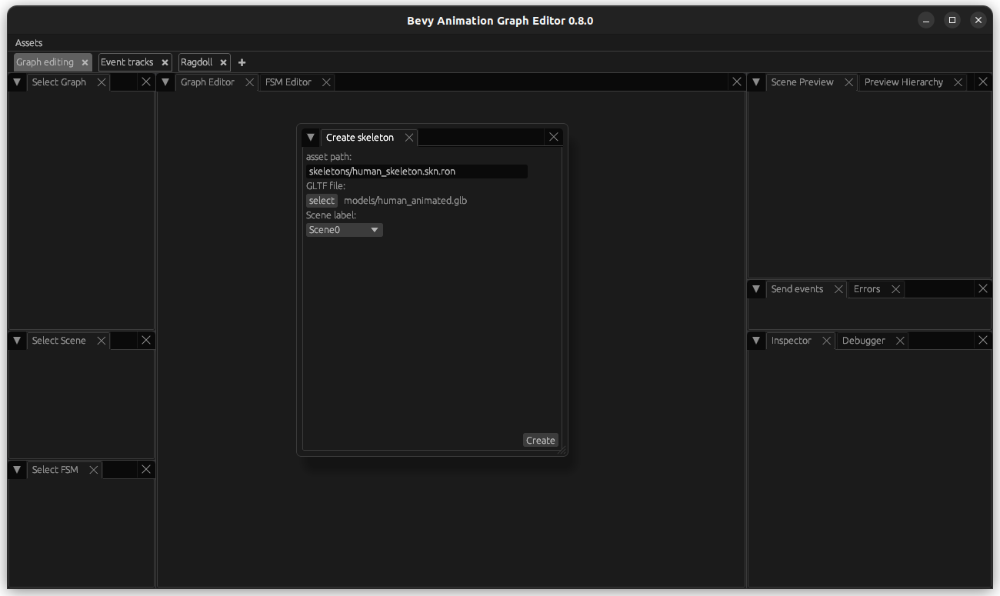
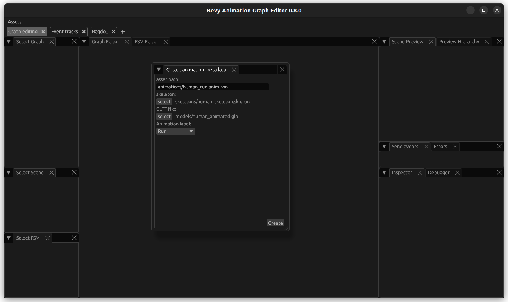
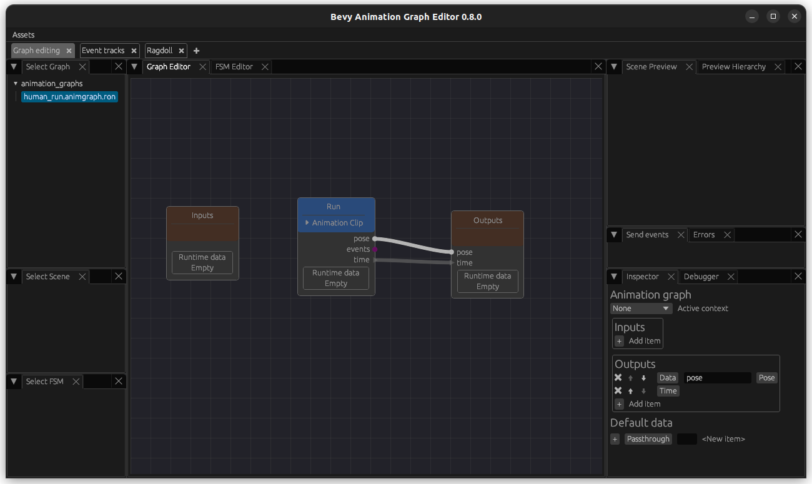
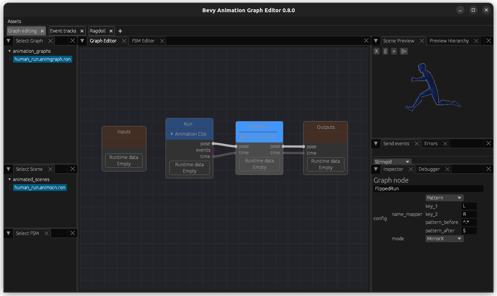
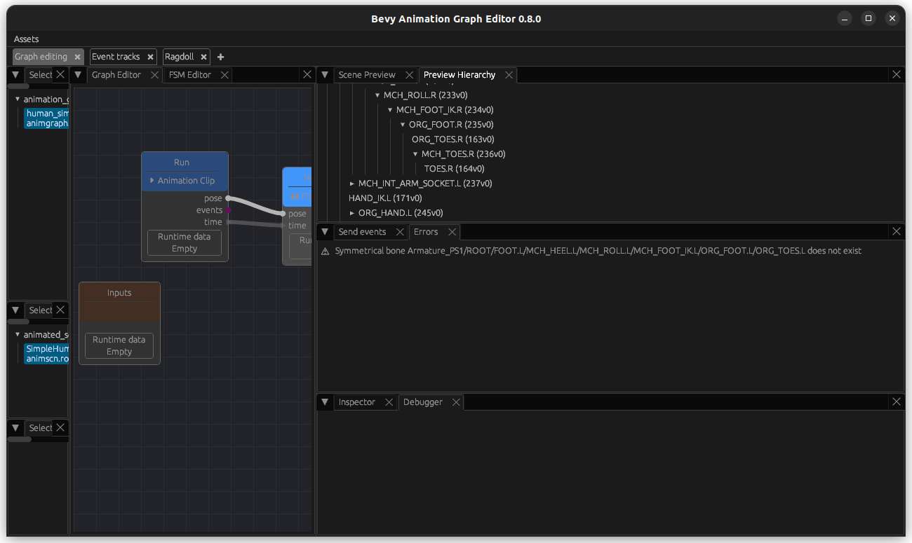
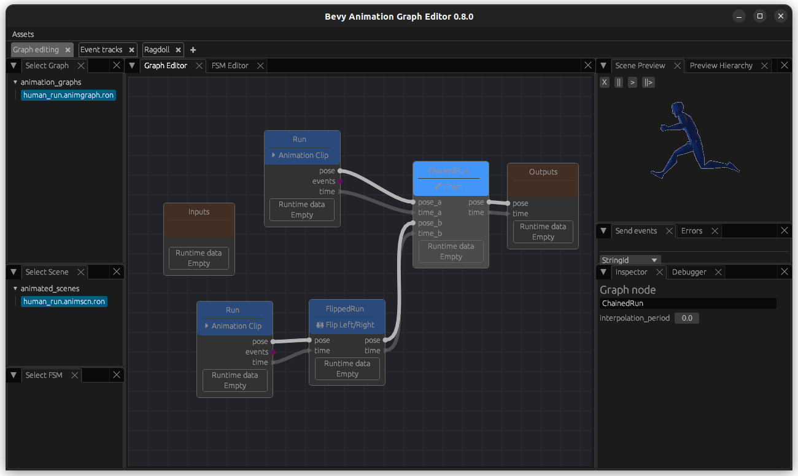
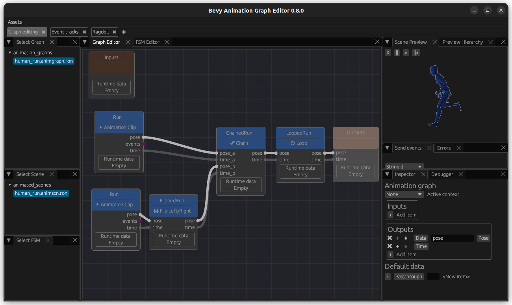

# Setup and run your first (run) animation

## Setup

Add bevy_animation_graph like you would for any rust crate to your game:

```
cargo add bevy_animation_graph
```

or add it to your Cargo.toml.

And then install the newest bevy_animation_graph_editor like this for the latest crates.io version (or use [`--version`](https://doc.rust-lang.org/cargo/commands/cargo-install.html#option-cargo-install---version) in order to specify the version you want e.g. the one you use in your game):

```
cargo install bevy_animation_graph_editor
```

<!-- QQ: Should we add a note specifying that you may want to set up a "custom editor binary" which will allow you to both 1. register your own animation nodes and 2. forever tie your editor version to the animation graph version you use in this particular project? -->

## Import your first animation

First, export your character with its animation in the .glb format from Blender or your respective modelling software. Mine is called human_animated.glb. 

In my example, I only exported half of the run cycle in my animation. This will enable me to demonstrate the use of some of the nodes. Note that for this, the starting and ending frame that I exported are exactly the same pose.

Create an empty assets directory and add the following subfolders:
- animated_scenes
- animation_graphs
- animations
- models
- skeletons

> **_NOTE:_** In your project, you are free to organise and name the assets folder up to your preferences. In this tutorial, I will follow the same structure as the crate examples and will describe the steps following the same organisation.

Then, let's start the animation graph editor pointing to our assets directory:

```bash
bevy_animation_graph_editor -a <PATH_TO_ASSETS_DIRECTORY>
```

Let's create a skeleton asset using the Assets (top left) -> Create -> Skeletons button:




Let's also create an animation asset using the Assets (top left) -> Create -> Animations button:



Finally, create an animation graph using the Assets (top left) -> Create -> Animation Graph button:


Select the animation graph. You can move the Inputs and the Outputs (initially underneath the Inputs) around to a convenient location for you. Then, create a `ClipNode`: right click on the graph editor canvas, select `ClipNode` on the list of node types (you can type in the search bar to filter), and specify your animation in the `clip` field. You can also give the node a label/name, but that's not required. 

> **_NOTE:_** You have to press Escape in order to close the node creator popup.


Arrange the nodes how you prefer it.

On the bottom right of the editor, you see an Animation Graph window where you can specify inputs and outputs. Add a Data - Pose type output named pose and a Time type output to it (you can add outputs with the + icon and change fields by clicking on them). Then connect the pose and the time output from the `ClipNode` to the Outputs node.

> **_IMPORTANT:_** Press Ctrl+S in order to open the Save menu and save your animation graph! **It is not auto-saved**.



Finally, the last step is to create a scene. This step is not enabled in the animation graph editor yet, so create a file with the following content in the `animated_scene` folder (in my case, named `human_run.animscn.ron`):

```ron
(
    source: "models/human_animated.glb#Scene0",
    animation_graph: "animation_graphs/human_run.animgraph.ron",
    skeleton: "skeletons/human_skeleton.skn.ron",
)
```

Restart your editor.

Now select your scene and you should be able to see at least your model loaded in the top right. Depending on the size of the model you need to scroll in or out of the preview by using your mouse while hovering above the preview. You should be able to see the animation that you are playing in the graph, but if it is a short one and you missed its playing, you should at least see your model loaded correctly in the preview. If you cannot see your model, here are a couple things you could try:

- Load the model in an online gltf viewer to see if there are any issues with it.
- If you're using Blender, make sure you use a triangulation modifier when exporting (if your model contains non-triangular faces).
- Make sure a material is assigned to the model. Not having a material assigned can lead to a race condition that sometimes makes it invisible (but not always).

## Mirror and chain it

In the case of this example, the animation was only the left half of a run-cycle: therefore, we need to _chain it_ with a mirrored version of itself in order to get a full run cycle.

If you have a full animation, you may skip this section, but it might be useful to read it anyway---for example, if you want to mirror an attack animation.

So first, create a `FlipLRNode`. Depending on your skeleton, update the filters for how the bones on the left side match to the right side: The defaults match configuration assumes left/right bone names end in L and R, respectively (and bones that shouldn't be mirrored have no L/R suffix). Then connect the `ClipNode` to it, and the `FlipLRNode` to the output. 



If there is no output, check the Errors tab that will display if there is a symmetry that is not found and use the Preview Hierarchy to figure out what is missing.



Now that we have succefully mirrored it, we want to play the non-mirrored animation followed by the mirrored animation. For this, first create another instance of the Run animation using a `ClipNode` - this will be our non-mirrored animation. 

Now create a `ChainNode`. Then connect the ouput of the non-mirrored animation to the inputs `pose_a` and `time_a` of the `ChainNode`. Connect the mirrored animation to the inputs `pose_b` and `time_b` of the `ChainNode`. As before, the output of the `ChainNode` go to the Output.



Now you should see both of them playing after another - since it is not looped, you may have to restart the animation_graph_editor to set the time to 0 and play it from the start (remember to save if you do that!).

## Loop it

Finally, it is time to loop this. Create a `LoopNode` with default settings. Connect the output of the `ChainNode` (or, if you did not work with an animation that you have mirrored, from your `ClipNode`), to your `LoopNode` inputs and the outputs of the `LoopNode` to the Outputs.



Now you should be able to see your animation repeating endlessly!

## Include it in your game

But most importantly - how do you actually use this in your game? A very simple example is found in the [human example in the crate repository](https://github.com/mbrea-c/bevy_animation_graph/blob/master/examples/human/examples/human.rs), but here are the most important points:

Register the animation graph plugin:

```rust
    App::new()
        // ... add your other plugins
        .add_plugins(AnimationGraphPlugin::default())
        // ... rest of your `App` setup
        .run();

```

And then spawn the animated character when needed:

```rust
    // Animated character
    commands.spawn((
        AnimatedSceneHandle::new(
            asset_server.load("animated_scenes/human_run.animscn.ron")
        ),
        Transform::from_xyz(0., 0., 0.),
    ));
```
