# Build your first basic FSM

## Pre-Requisites

This chapter assumes you know how to create an Animation asset, an AnimationGraph asset, a `ClipNode` and have an already existing AnimationGraph containing a looped Running animation (which has been shown in the previous chapter). In addition to that, you should also have a simple attack animation in your .glb file - for example, I have a punching animation.

> **_IMPORTANT:_** I will not mention that you need to remember to save throughout this tutorial, but please do this whenever you complete changing an animation graph or an fsm! 

## Create Punch animation graph

First, create an animation asset with your Punch animation in `animations/human_punch.anim.ron`.

Then create a new animation graph under the path `animation_graphs/human_punch.animgraph.ron`.

Create a `ClipNode` containing your punching animation, re-arrange the graph, add the `pose` and `time` outputs and connect the corresponding edges. 

Save your animation graph and create a new scene in your `animated_scenes` folder named `human_punch.animscn.ron`, pointing to the new animation graph.

Restart your editor and select the new scene. As before, you should at least see your model now - our animation only plays once.

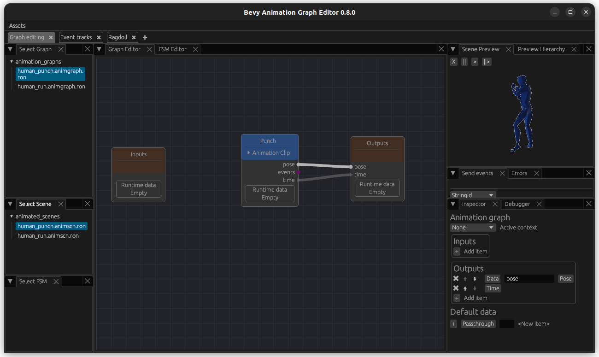

## Create your first FSM

Create a new folder named fsm (and restart your editor after this). Then, select Assets (top left) -> Create -> State machine and create one under the path `fsm/human_basic_fsm.fsm.ron`. 

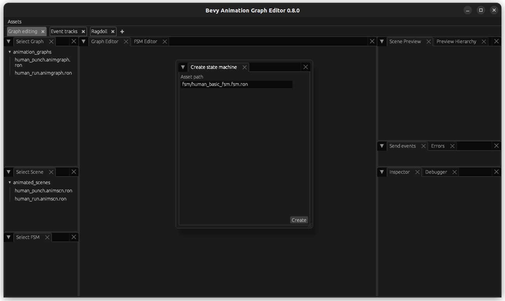

Select your FSM and go to the FSM Editor tab. Create the first `Run` state by right-clicking on the fsm editor canvas. Give the state a label (Run), and link it to the corresponding animation graph. Leave the rest as default. Use Escape to close this menu.

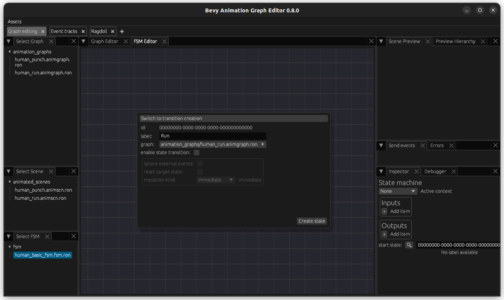

> **_NOTE:_**  Ticking the enable state transition checkbox allows every other state in your FSM to transition to this state using the transition you define there. This is useful if you have a state that should always be reachable - you do not need to create all those transitions by hand. If in addition, a direct transition (how to create these is explained below) is defined, the direct transition behaviour will take precedence. If this option is enabled, the state will have a little lightning bolt icon.

Then, create another state with the label `Punch`, linking to the punch animation graph.

As before, you can drag the states to your preferred arrangement.

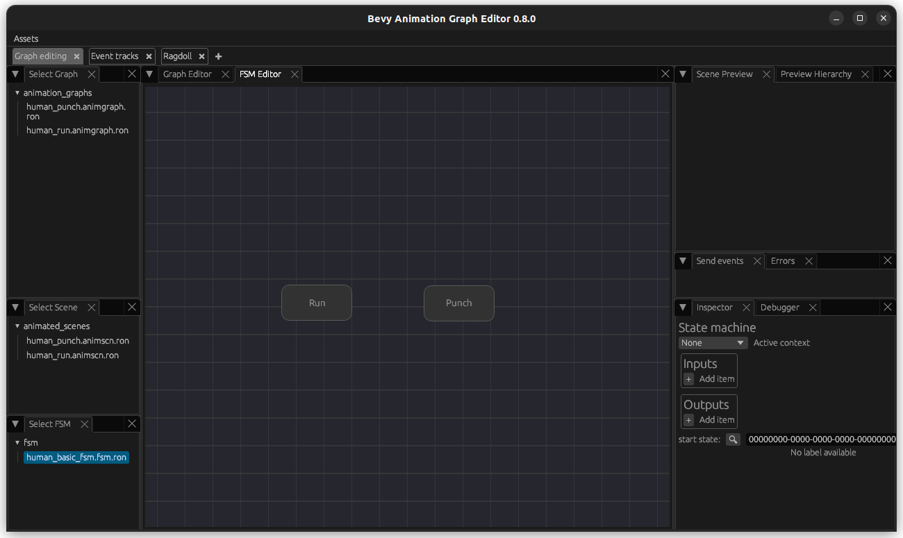

Like for any FSM, we also need to provide the start state in the state machine Inspector on the bottom right: choose the `Run` state. 

> **_NOTE:_**  This will add a second box around the `Run` state indicating that it is the start state in the FSM editor UI.

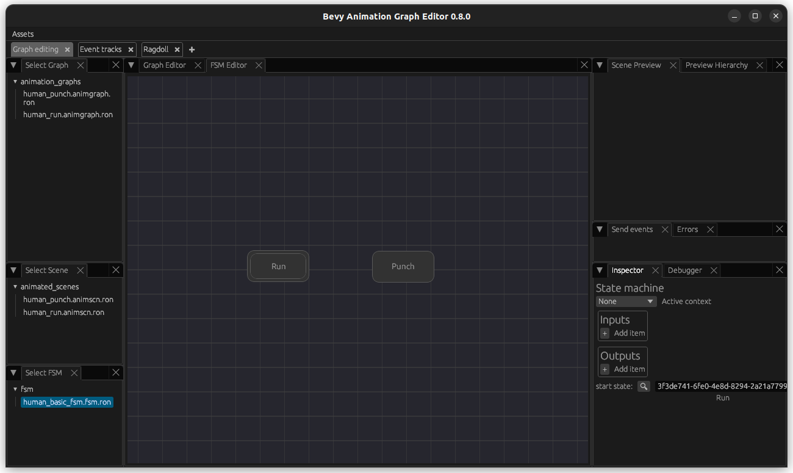

Now we need to add the transition from `Run` to `Punch`: right-click again and click on `Switch to transition creation`. Select `Run` as the source state and `Punch` as the target state. Remember that we only play the punch animation once - so for this graph, our time needs to be reset to 0 in order for the animation to actually be visible. In order to do this, tick the `reset target state` box. Leave the rest at their default.

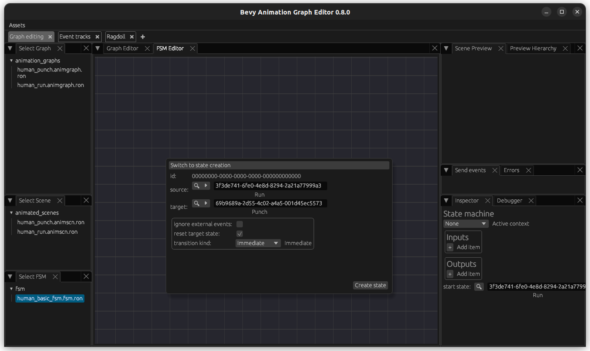

Add another transition from `Punch` (source state) to `Run` (target state), but leave all settings at their default state.

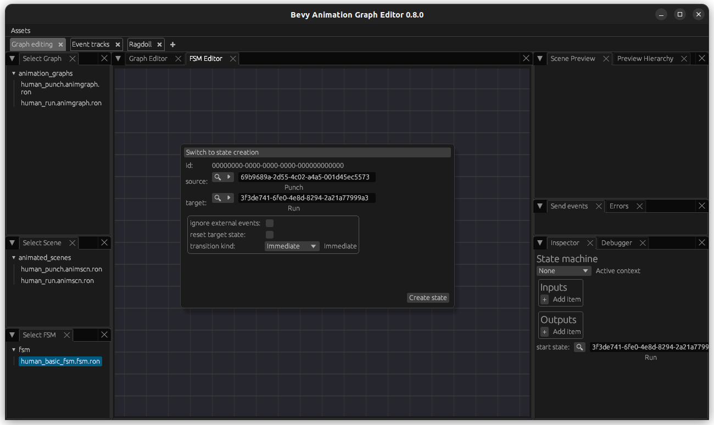

The transitions will be illustrated as arrows and if you want to edit them in the future, you only need to select them.

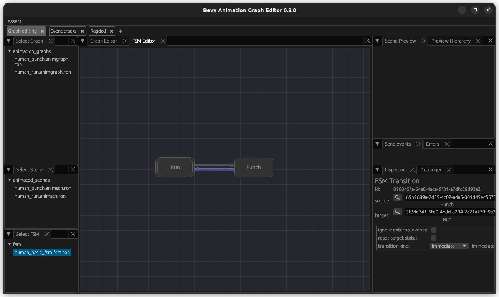

Finally, add the pose and time output as we did for our animation graphs so far.

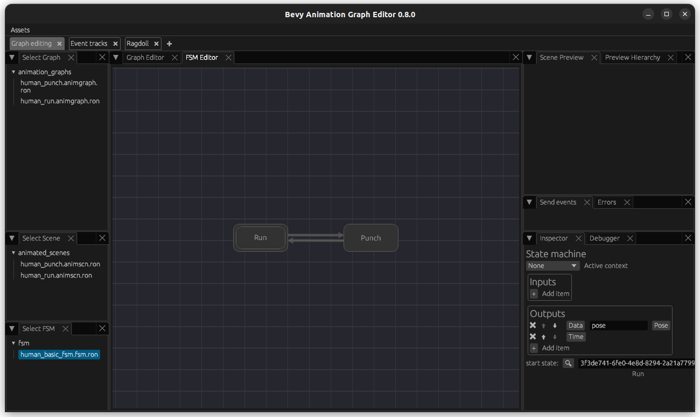

## Use and test your FSM in an animated scene

Create a new animation graph called `animation_graphs/human_basic_fsm.animgraph.ron`, select it and switch back to the Graph Editor tab. Create an `FsmNode` and link it to your graph.

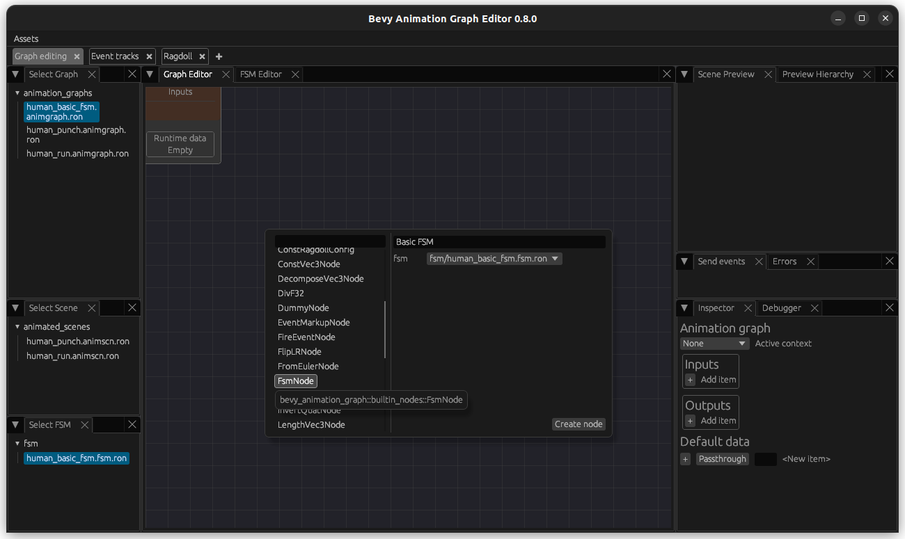

You will notice that this node takes `driver_events` as input - this will be the events that are used to trigger transitions. These need to come from another node in the graph, in our case Inputs directly - so click on it and add an input called user_events of type Data - Passthrough - EventQueue and connect the edges.

In addition, add the pose and time outputs as usual and connect them.

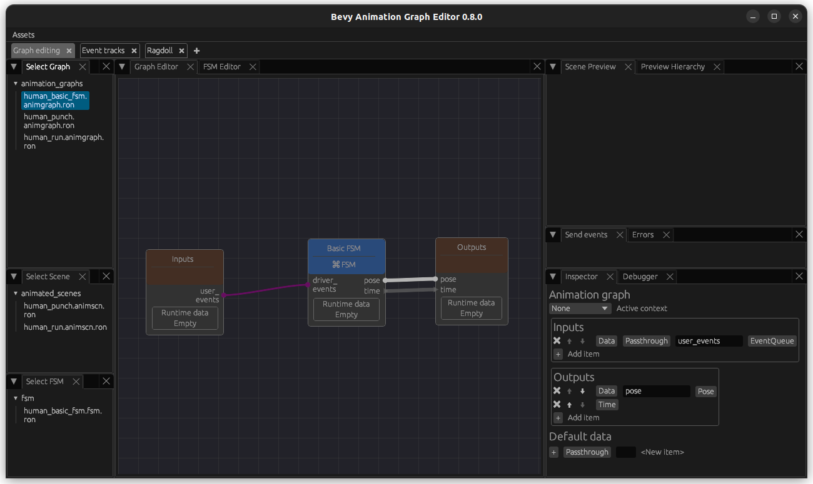

In order to get our preview working, lets create a new scene in your `animated_scenes` folder named `human_basic_fsm.animscn.ron`, pointing to the `human_basic_fsm.animgraph.ron` animation graph.

Restart your editor and select the scene. You should see your character running. If this is not the case, go through the steps above again and check if you missed anything.

> **_NOTE:_** In the FSM editor, you can see the state you are currently in highlighted in green.

Now, we want to test a transition: Go to the `Send Events` menu (on the right in the middle). Add an event of type `TransitionToStateLabel`, name it Punch and click add. 

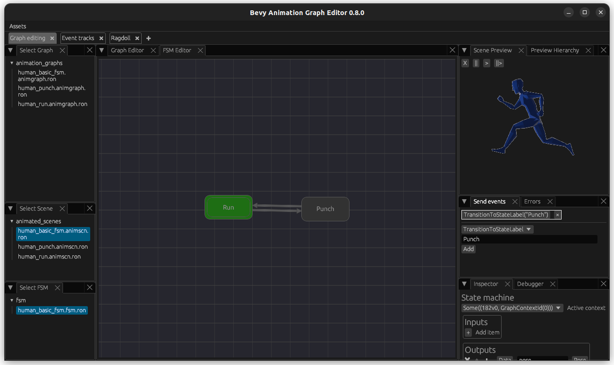

Then click on the newly created button. Now you should see your Punch animation playing once and the `Punch` state should be hightlighted in green.

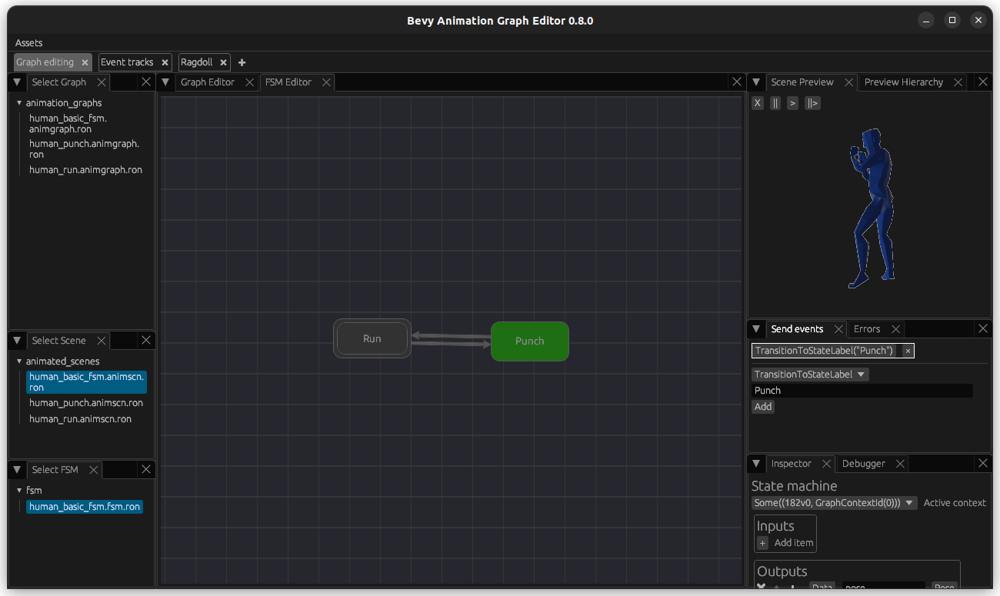

Now you can add another `TransitionToStateLabel` named Run and switch between those two states as you desire.

## Issue 1: we should leave punch state after punch

While this basic setup works, there is one immediate issue: Why do we stay frozen in the punch stance at the end of the animation instead of automatically switching back to another reasonable animation? In our case, we would want to switch back to the running state at the end of our punch animation.


> **_NOTE:_** Remember that for the sake of simplicity, we only have two states here - in your own game, you can have another state to switch to, for example an idle stance. In a later chapter, we will cover a more advanced setup including a more advanced FSM.

In order to achieve this, we first need to know when the punch animation ends and fire an event to transition to the `Run` node: Open your `human_punch.animgraph.ron` graph and let's add a `MapEventNode`, which gets triggered (`map_from`) when the animation clip ends (`AnimationClipFinished`) and fires (`map_to`) a transition to `Run` event (`TransitionToStateLabel` type).

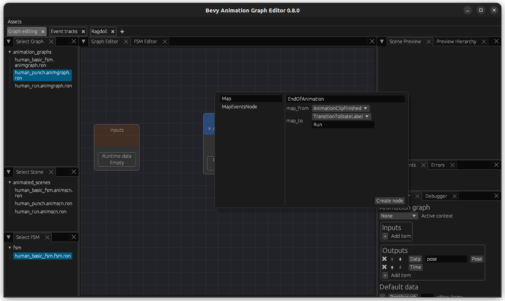

Now we need to add events to the output: Create a new output called driver_events of type Data - EventQueue and connect it.

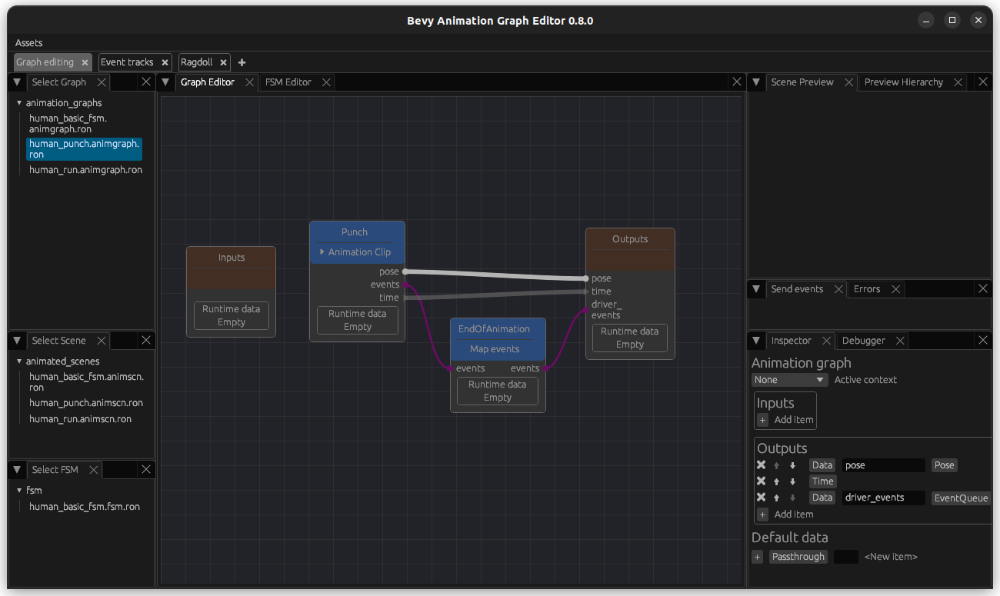

This is all that is required to make it automatically switch back to running after the animation ends - give it a try!


## Issue 2: our state transitions are too abrupt

Another obvious issue is that the transition is very abrupt: one solution is to actually add hand-made animations for the  transitions. In order to do this, you simply need to put them into an animation graph, enter your FSM, select your transition and change the transition kind to `Graph`, pointing it at the animation graph containing your animation.

However, adding this for all possible transitions is a lot of work, especially if you are just starting developing your game and you want it to look smooth, but it does not need to be perfect. Even later the solution proposed below might feel good enough that you don't need to add custom transition animations. 

For a simple and resuable solution, we can create a custom animation graph that will simply blend the animations from the source and the target state for a defined amount of time.

Create an animation graph called `animation_graphs/blend_transitions_fsm.animgraph.ron`. Create a `BlendNode` leaving the default as they are. As you see, it takes a `factor`, `pose_a`, `time_a`, `pose_b`, and `time_b`. 

Lets think about what the factor could be: How about it blends the transitions for the transition duration with a weight increasing linearly from 0 to 1 (which denotes the weighting of pose_b)? Luckily there is an input type for getting exactly this value: Add an input of type Data - FsmBuiltin - PercentThroughDuration and connect it to `Factor`. 

In addition, lets add an input of type Data - FsmSource - Pose called pose and another input of type Time - FsmSource called time and connect them to pose_a and time_a. Finally add an input of type Data - FsmTarget - Pose called pose and another input of type Time - FsmTarget called time and connect them to pose_b and time_b. 

> **_IMPORTANT:_** The naming of the input variable must match the output variable names of the AnimationGraphs used in the corresponding FSM States. That is why using pose and time as output variable names whenever possible makes it easier to write general animation graphs like this, it can now be reused as long as we only have animation graphs following the same output variable naming conventions.

As usual, add pose and time outputs and connect the node.


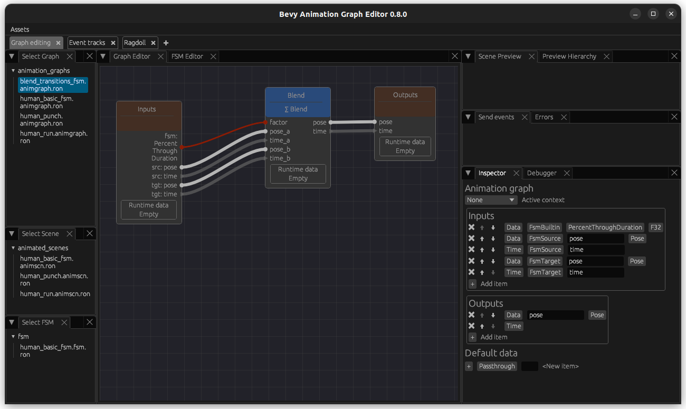

Let's go back to our FSM and change both transitions: Set the transition kind to `Graph` and select our new animation graph. Make it timed and set it to a value that feels good when you look at it - I used 0.1 for the transition from `Run` to `Punch` and 0.5 for switching from `Run` to `Punch`.

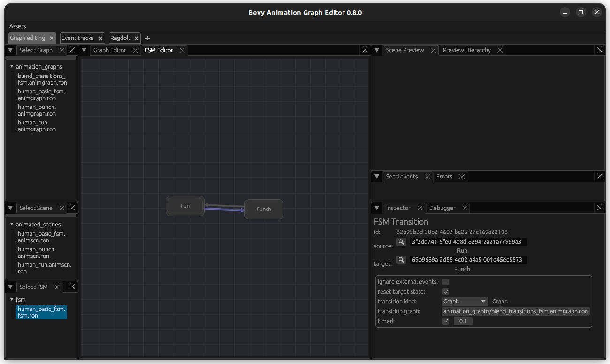
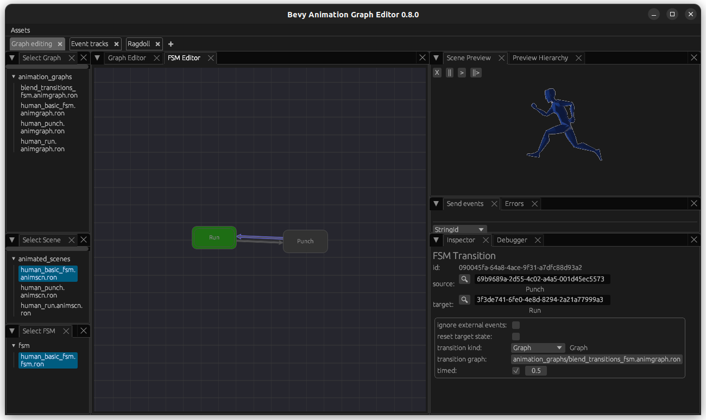

I finetuned these values with a Punch event in the `Send events` tab and just adjusted them until it looked good. 

## Passing events from your code

Now you will need to send the `Punch` event from your game. Sending an event is very easy, assuming that you have `player`, which is the mutable player instance associated with the AnimationGraphPlaywer:

```rust
player.send_event(AnimationEvent::TransitionToStateLabel("Punch".into()));
```

For a complete example, you can refer to the [human fsm example in the crate repository](https://github.com/mbrea-c/bevy_animation_graph/blob/master/examples/human_fsm/examples/human_fsm.rs).