# A speed-based run-walk controller

In this chapter, we will learn how to use a speed variable to smoothly blend a walk and a run animation.

## Pre-Requisites

This chapter assumes you know how to create an Animation asset, an AnimationGraph asset, a `ClipNode`, `ChainNode` and `LoopNode`. In addition to that, you should have a run and a walk-cycle animated (here, I have a half of a run-cycle as a clip and a full walk cycle.), and an Asset of type animations created for both.

> **_IMPORTANT:_** I will not mention that you need to remember to save throughout this tutorial, but please do this whenever you finish changing an animation graph or an FSM! 


## The formulas behind blending speed and walk animations

First we need to find the formula for blending walking and running based on their respective speeds and the target speed. 

Up to a certain speed (`blend_start`) we only play the walk animation and do not blend. Between `blend_start` and `blend_end` we blend the walk and run animation. For a speed higher than `blend_end`, we want to play only the running animation. We can compute this `blend_factor` as follows:

```
blend_factor = clamp((target_speed - blend_start) / (blend_end - blend_start), 0, 1)
```

In addition to this, we also want a playback speed factor since the speed of the walking or running playback will need to be adjusted based on the speed of the character: 

```
speed_factor = target_speed / (walk_base_speed * (1 - blend_factor) + run_base_speed * blend_factor)
```

## Create a custom node with our blend factor

Lets start by creating a new custom node in a new file named locomotion_blend_parameters_node.rs which simply does the above calculations.

For this, we need to define the input and output nodes and their types (`specs`), what it does on an `update` (e.g. what gets done by the node each step) and its `display_name`

```rust
extern crate bevy;
extern crate bevy_animation_graph;

use bevy::prelude::*;
use bevy_animation_graph::core::{
    animation_node::{NodeLike, ReflectNodeLike},
    context::{new_context::NodeContext, spec_context::SpecContext},
    edge_data::{DataSpec, DataValue},
    errors::GraphError,
};

#[derive(Reflect, Clone, Debug, Default)]
#[reflect(Default, NodeLike)]
pub struct LocomotionBlendParametersNode;

// First we define the input and outputs of our node. We will take in all the values required for the calculations
// and output the result. We define the names of the input and outputs here.
impl LocomotionBlendParametersNode {
    // walk_base_speed
    pub const IN_WALK_BASE_SPEED: &'static str = "walk_base_speed";
    // run_base_speed
    pub const IN_RUN_BASE_SPEED: &'static str = "run_base_speed";
    // target_speed
    pub const IN_TARGET_SPEED: &'static str = "target_speed";
    // blend_start
    pub const IN_BLEND_START: &'static str = "blend_start";
    // blend_end
    pub const IN_BLEND_END: &'static str = "blend_end";
    // blend_factor
    pub const OUT_BLEND_FACTOR: &'static str = "blend_factor";
    // speed_factor
    pub const OUT_SPEED_FACTOR: &'static str = "speed_factor";
}

impl NodeLike for LocomotionBlendParametersNode {
    fn update(&self, mut ctx: NodeContext) -> Result<(), GraphError> {
        // We can read the inmput data. Nodes are evaluated lazily, so
        // whatever is connected to the inputs won't compute anything until we attempt to read them.
        // the distance a full walk cycle moves
        let walk_base_speed = ctx
            .data_back(Self::IN_WALK_BASE_SPEED)
            .unwrap_or(DataValue::F32(1.29))
            .into_f32()?;
        // the distance a full run cycle moves
        let run_base_speed = ctx
            .data_back(Self::IN_RUN_BASE_SPEED)
            .unwrap_or(DataValue::F32(3.54))
            .into_f32()?;
        let target_speed = ctx.data_back(Self::IN_TARGET_SPEED)?.into_f32()?;
        // blend start parameter: the speed at which to start blending with the run - experiment what feels good
        let blend_start = ctx
            .data_back(Self::IN_BLEND_START)
            .unwrap_or(DataValue::F32(1.9))
            .into_f32()?;
        // blend run parameter: the speed at which to always run - experiment what feels good
        let blend_end = ctx
            .data_back(Self::IN_BLEND_END)
            .unwrap_or(DataValue::F32(3.))
            .into_f32()?;

        // lets do the calculations described in the tutorial
        let blend_factor = ((target_speed - blend_start) / (blend_end - blend_start)).clamp(0., 1.);
        let speed_factor =
            target_speed / (walk_base_speed * (1. - blend_factor) + run_base_speed * blend_factor);

        // Publish the output pose to the corresponding output data pin
        ctx.set_data_fwd(Self::OUT_BLEND_FACTOR, blend_factor);
        ctx.set_data_fwd(Self::OUT_SPEED_FACTOR, speed_factor);

        Ok(())
    }

    fn display_name(&self) -> String {
        // This is the name that will be displayed in the editor for the node
        "Locomotion Blend Parameters node".into()
    }

    // Specify the data type for all the inputs and outputs
    fn spec(&self, mut ctx: SpecContext) -> Result<(), GraphError> {
        // Specify input data pins for this node with the correc type
        ctx.add_input_data(Self::IN_WALK_BASE_SPEED, DataSpec::F32);
        ctx.add_input_data(Self::IN_RUN_BASE_SPEED, DataSpec::F32);
        ctx.add_input_data(Self::IN_TARGET_SPEED, DataSpec::F32);
        ctx.add_input_data(Self::IN_BLEND_START, DataSpec::F32);
        ctx.add_input_data(Self::IN_BLEND_END, DataSpec::F32);

        // Specify output data pins for this node with the correct tyope
        ctx.add_output_data(Self::OUT_BLEND_FACTOR, DataSpec::F32);
        ctx.add_output_data(Self::OUT_SPEED_FACTOR, DataSpec::F32);

        Ok(())
    }
}

```

Then we need to create a custom editor as a plugin that includes our blendnode in a separate bin directoy in a file I named editor.rs - that way we can run it and keep the version of the editor as a dev dependencies while also using the CustomNodes both in our plugin binary as well as in our game. 


```rust
use bevy::app::App;
use bevy_animation_graph_book::locomotion_blend_parameters_node::LocomotionBlendParametersNode;
use bevy_animation_graph_editor::AnimationGraphEditorPlugin;

fn main() {
    let mut app = App::new();
    app.add_plugins(AnimationGraphEditorPlugin);
    app.register_type::<LocomotionBlendParametersNode>();
    app.run();
}
```

And you can run it like this:

```bash
cargo run --bin editor -- -a assets
```

## Create the run-walk animation graph

Then we create a new animation graph for our controller and name it human_run_walk_blend.animgraph.ron. In this graph, we add a new node named `WalkRunBlend` of our new custom type `LocomotionBlendParamtersNode`.

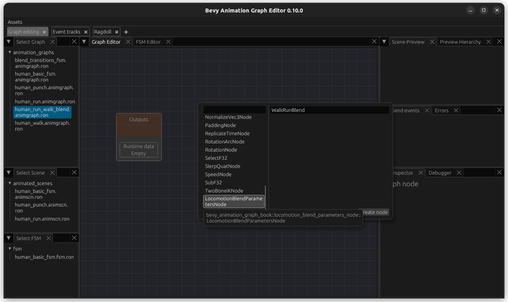

Then we want to create a new simple run Graph. I named this one AnnotatedRunGraph although for now, it is a simple Run graph without a `LoopNode` (e.g. chain the flipped animation and the normal animation). Note that I have connected the flipped animation first since walk start with the left foot as well.

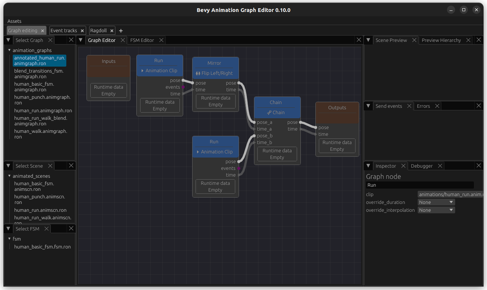

Then, back in our human_run_walk_blend.animgraph.ron, create a `ClipNode` containing our walk animation. Next add a `GraphNode` that points to our newly created run graph. In addition to this, we will also add an input named `speed`. Our graph looks like this so far:

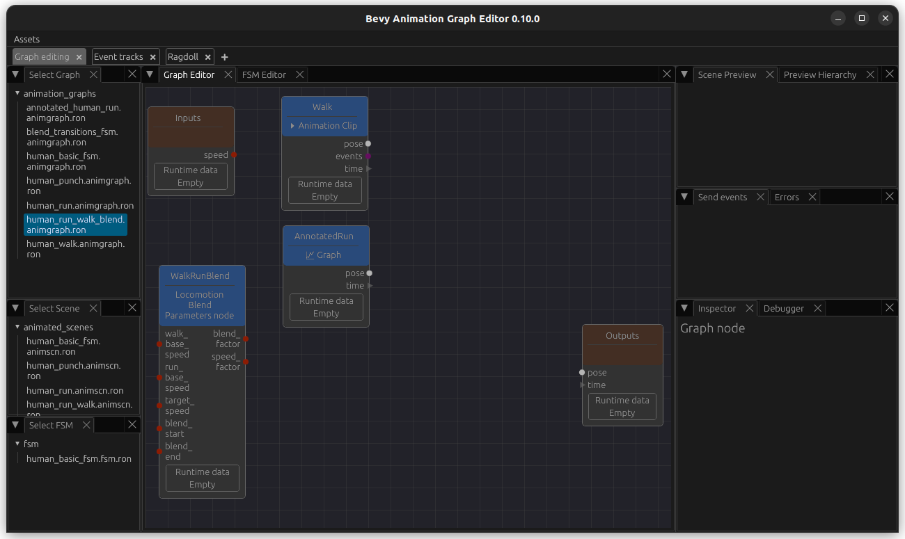


Now we add the blend node. We update `blend_primary` to use `HighestWeight`. This bases the duration of the `BlendNode` on the input with the higher weighting, which looks better since we have two inputs with two different lengths.

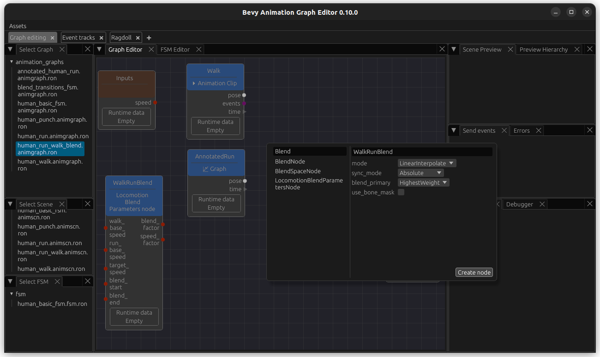

Now connect the `blend_factor` and the `pose `and `time` outputs from the walk and run animation nodes to it like this and add pose and time outputs. We also connect the `speed` input. 

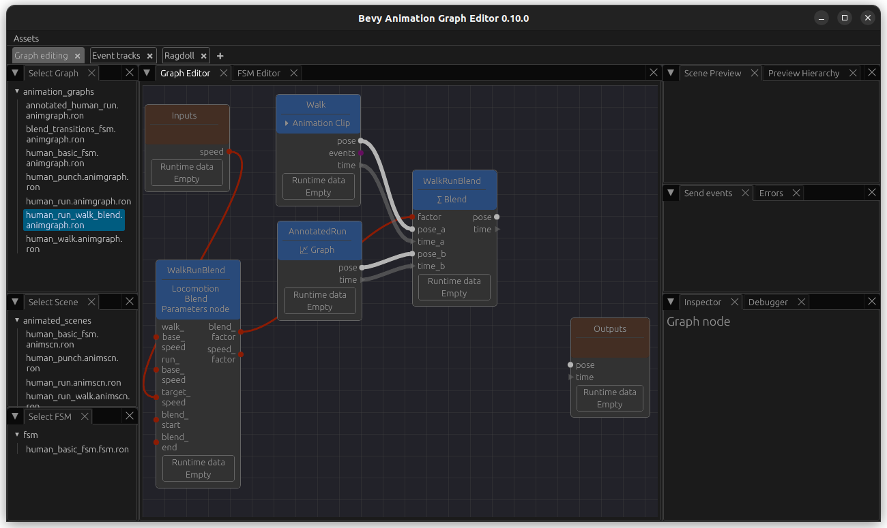

Finally, add a `LoopNode` add the end and connect it all together. As before, create a scene with this animation graphs so we can use the preview. In order to be able to test this, we also add `speed` as a passthrough parameter (bottom right) and we can adjust its values and see how the walk and run gets overlayed with each other.

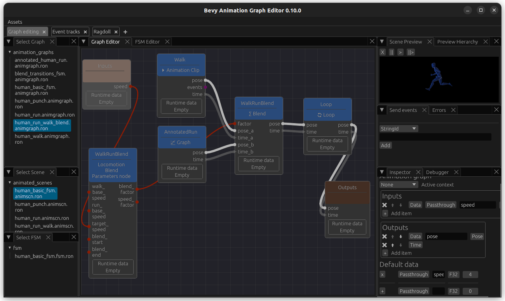

Now we can change the value of the passthrough parameter to see how it looks like at different `blend_factor`s.

Finally, we want to be able to adjust the speed at which the animations are played at - for this, add a `PlaybackSpeedNode` and connect the speed to it. Now we can see that the animations are played faster or slower based on the speed, whereas before they were just blended based on it.

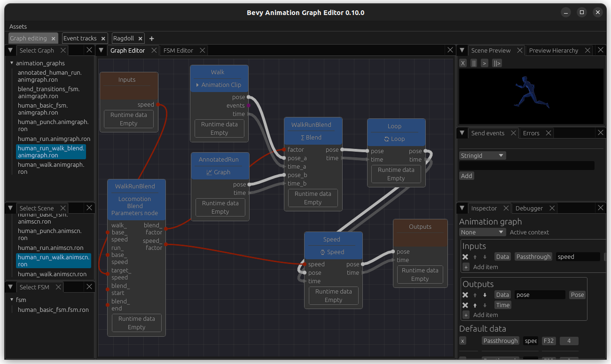


## Add event track annotation in order to sync foot down events

While playing around you might notice the the blending is not perfect - for example, in my animations the feet are put down at slightly different timings, leading to a weird-looking blend. 

This is a good use case for sync events: if you annotate your animation tracks with events, they will blend over each other based on this. So we will add foot down events for our animations. It will also be very useful when your animations do not start with the same foot.

Go to the `Event tracks` tab. In the bottom half, keep `Clip` selected and open animation/human_walk.anim.ron. At the top, select animated_scenes/human_run.animscn.ron (this scene should refer to the correct skeleton, otherwise it does not matter much).

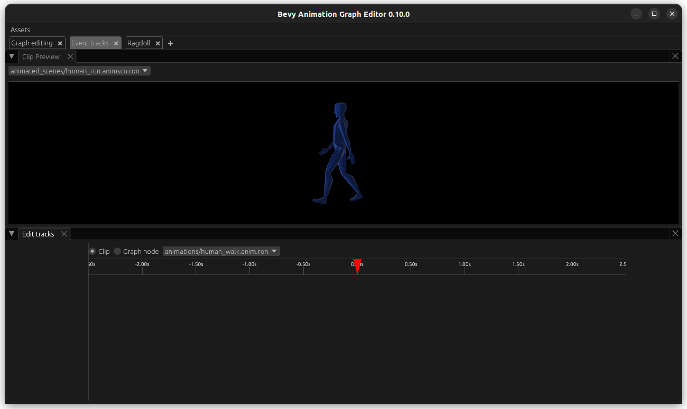

Then, hover with your mouse over the empty space underneath `Edit tracks` (bottom left) and right-click. Select `New Track`, give it a name like `FootDown`, for example `FootDown` and hit `submit`. 

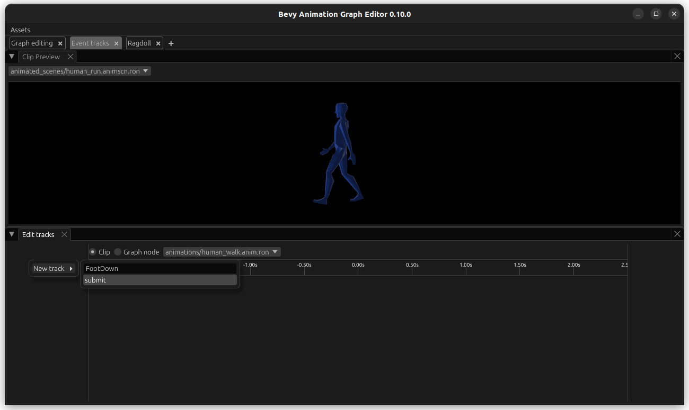

RightClick on the empty space underneath the time (in line with the track on the left), give the event a name like `LeftFootDown`, and update the times on when it ocurrs. 

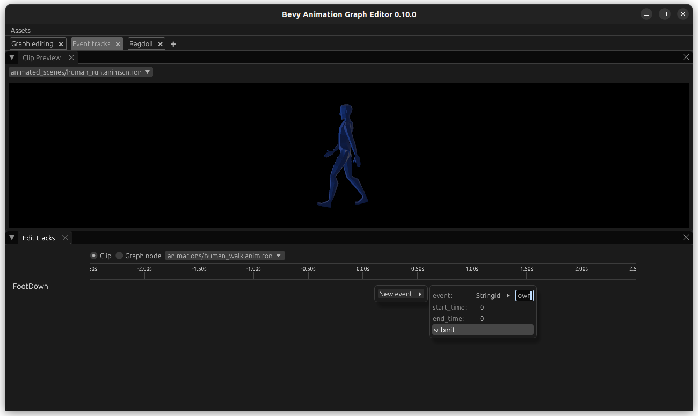

Hit `submit` and you should be able to see it. Do the same for `RightFootDown` at the correct time.

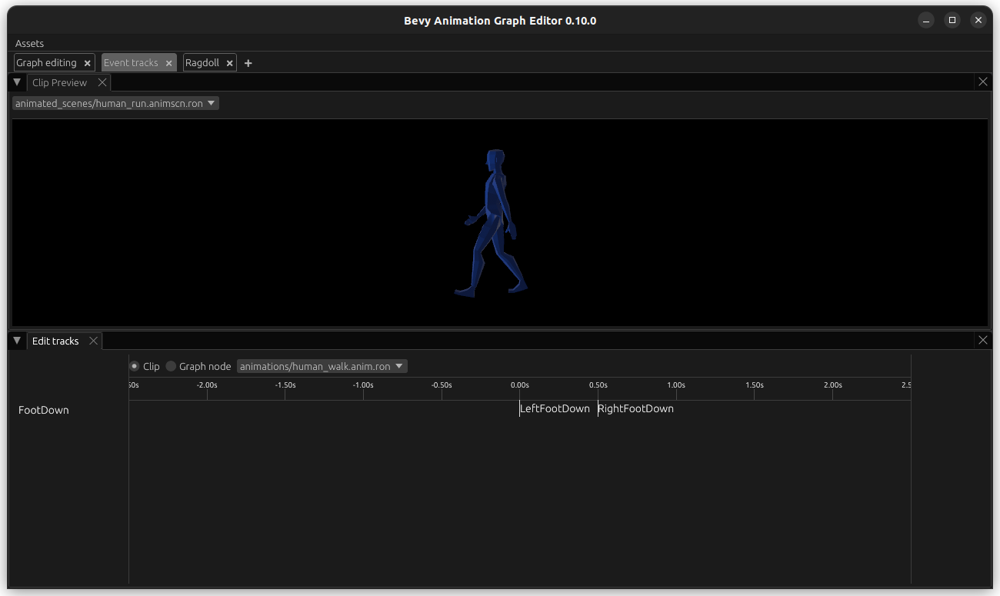

Now we want to do the same for our run animation. However, we only have half a run cycle - so we would like to base this off our `annotated_human_run` animation graph since that is the asset that contains the full cycle. Luckily, this is easy to achieve. Open the animation graph and add a `EventMarkupNode` named `Annotate` to it.

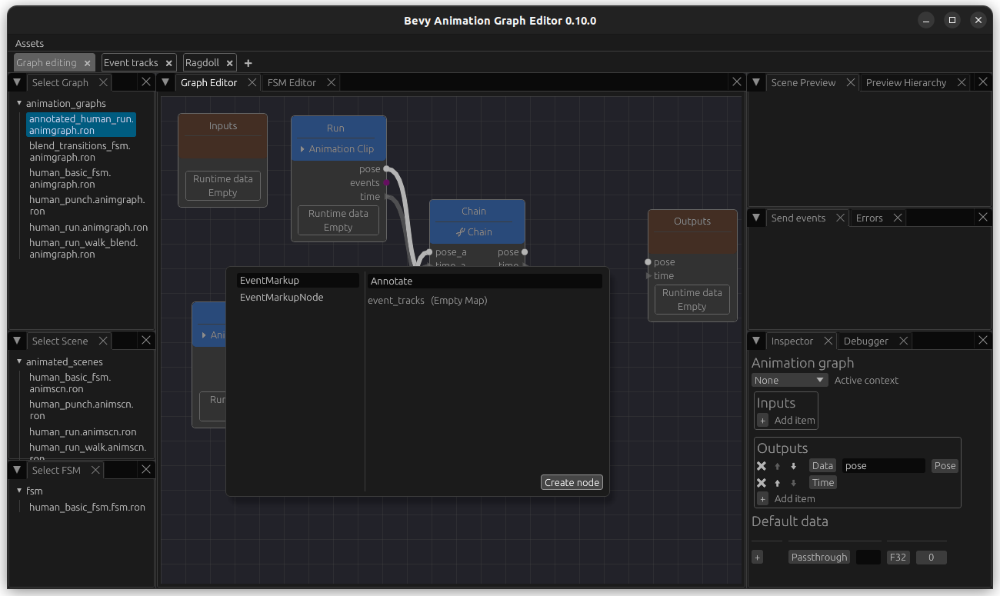

Add and output named `events` of type EventQueue and connect it.

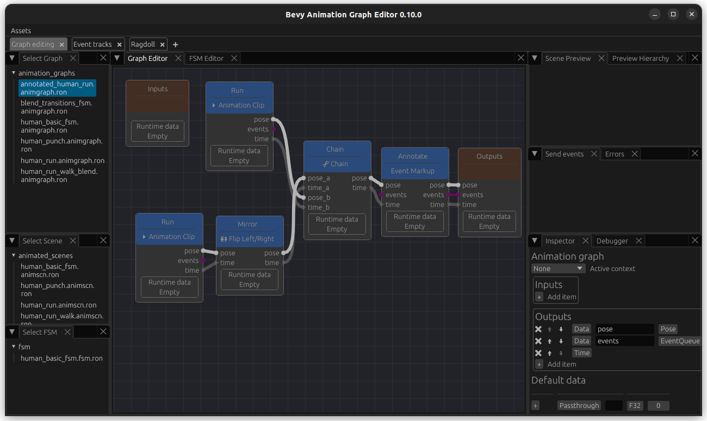

Now we go back to the Event track editor. On the bottom tab, select the type `Graph Node`, select our `annotated_human_run` graph followed by our `MarkupEventNode` `Annotate`. Select a scene with the same skeleton at the top. 

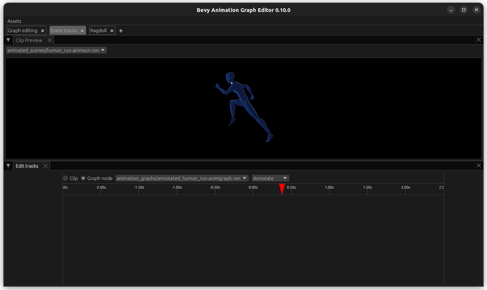

Now you can create an `Event track`, and name it `FootDown` again. Add the event `LeftFootDown` and `RightFootDown` as well. It is important that the naming of both event track and events is consistent between the animations that we want to sync.

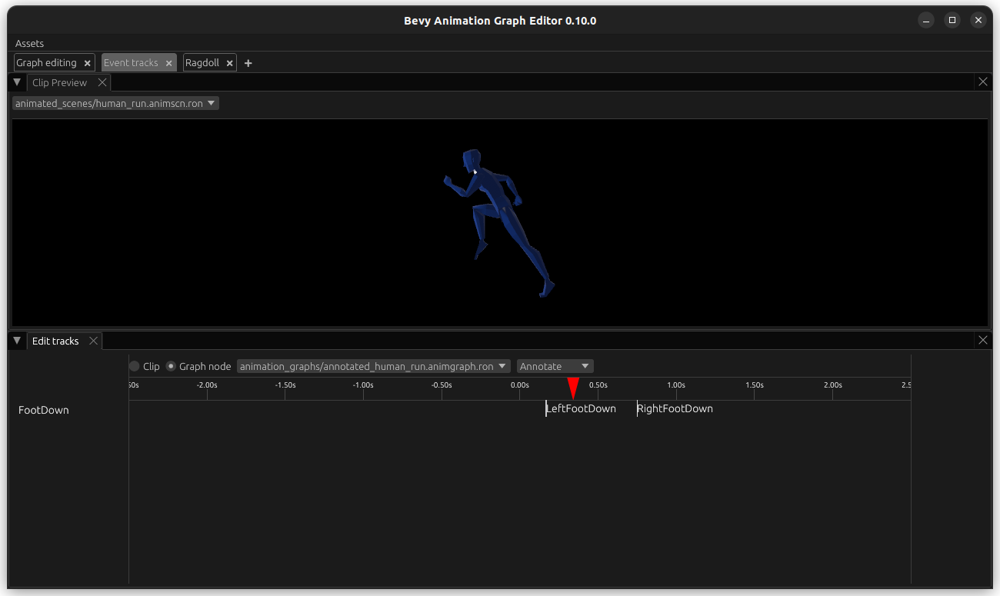

This data is also visible when you enter our `annotated_human_run` and select the node named `Annotate` for inspection - you can also edit values.

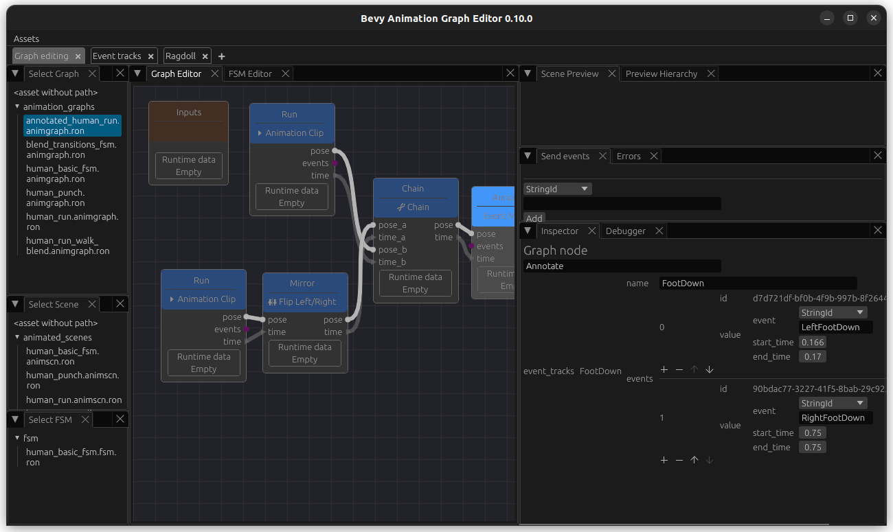

## Update run-walk animation graph to sync based on events

Click on the WalkRunBlend node to edit it and change its `sync_mode` from `Absolute` to `EventTrack`. In the field under it, enter the name of it: `FootDown`. Connect the events from walk and run to the respective inputs on the `BlendNode`. Now this is blended based on events.

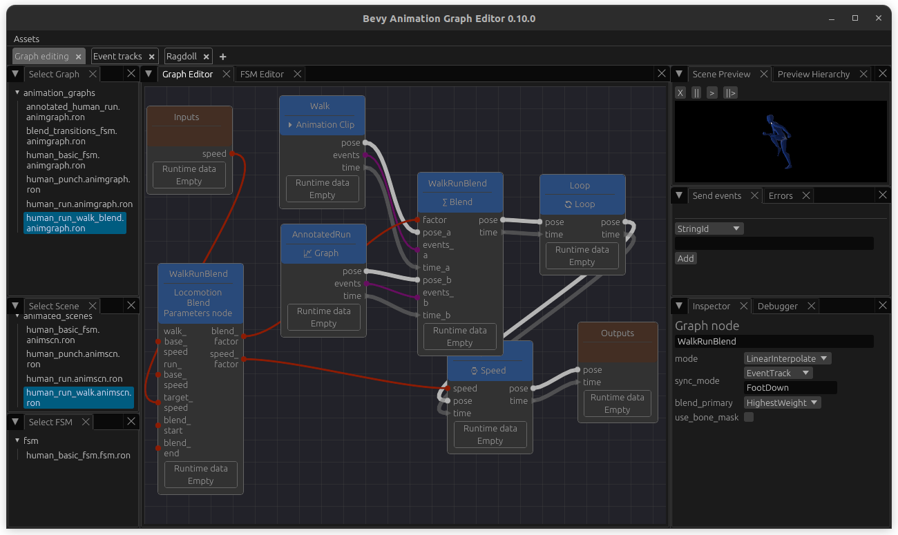