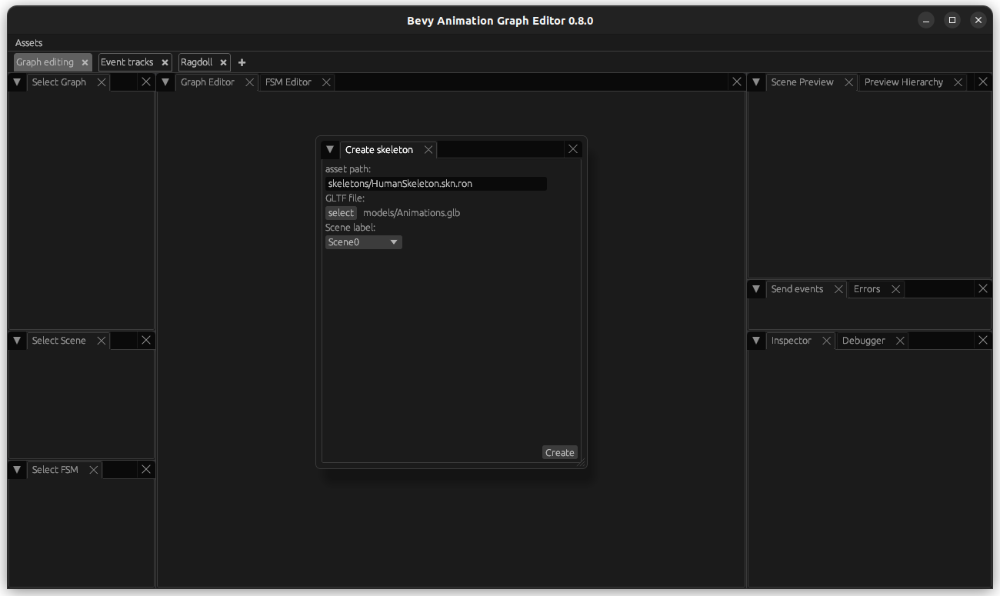
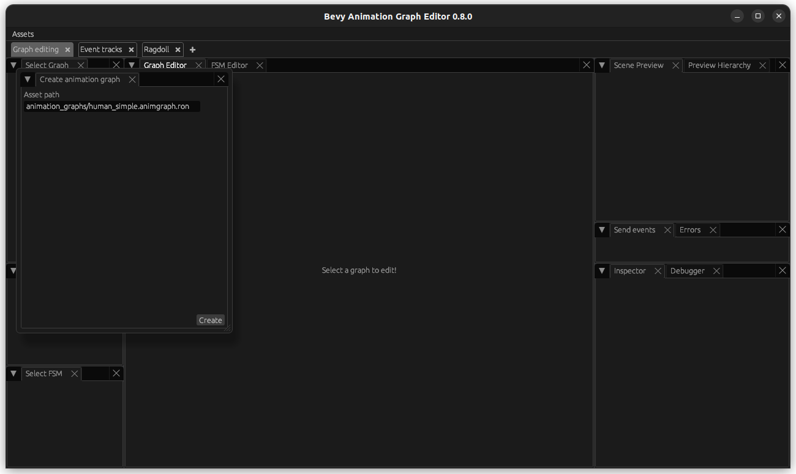
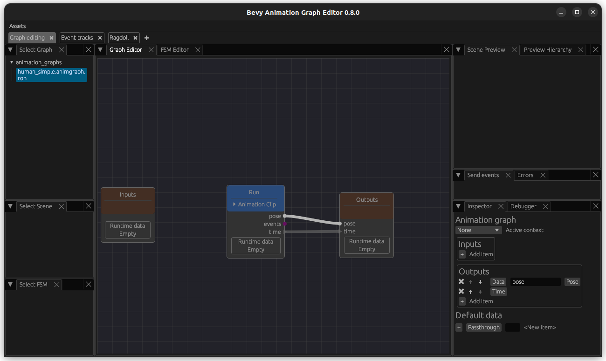
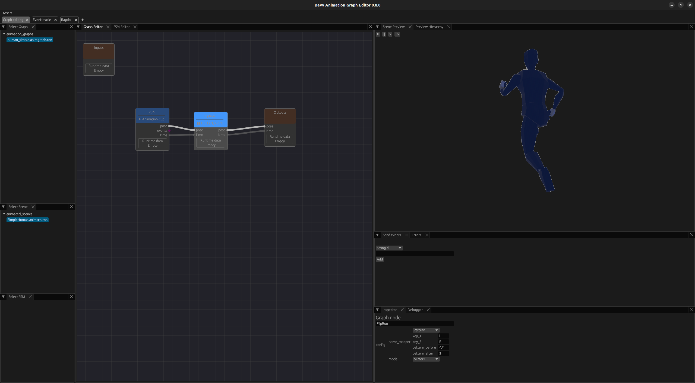
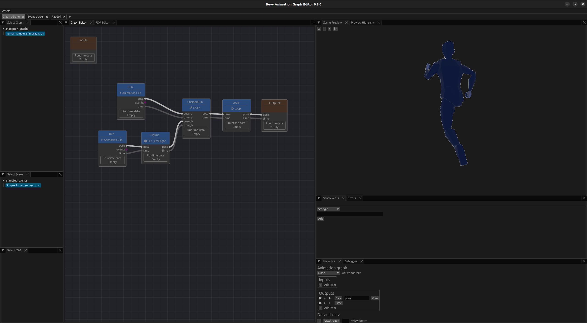

# Setup and your first (run) animation

## Setup

Install bevy_animation_graph like you would for any rust crate:

```
cargo add bevy_animation_graph
```

or add it to your Cargo.toml.

And then install the newest bevy_animation_graph_editor like this for the latest crates.io version:

```
cargo install bevy_animation_graph_editor
```

## Import your first animation

First, export your character with its animation in the .glb format from Blender or your respective modelling software.

In my example, I exported half of a run animation. This will enable me to demonstrate the use of some of the nodes. 

In your project, you are free to organise and name the assets folder up to your preferences. In this tutorial, I will follow the same structure as in the examples and will describe the actions following the same organisation.

Create an empty assets directory and add the following subfolders:
- animated_scenes
- animation_graphs
- animations
- models
- skeletons


Then, let's load it into the graph editor:

```
bevy_animation_graph_editor -a <PATH_TO_ASSETS_DIRECTORY>
```

Now, let's create a skeleton asset using the Assets (top left) -> Create -> Skeletons button:




Now, let's create an animation asset using the Assets (top left) -> Create -> Animations button:


Now, let's create an animation graph using the Assets (top left) -> Create -> Animation Graph button:



And then, create a ClipNode by right-clicking and selecting ClipNode with you animation. Note that you have to press Escape in order to close the window.


Now, move the input, clip and output node around to your preferred arrangement. 

On the bottom right of the editor, you see an Animation Graph window where you can specify inputs and output. Add a pose and a time output to it (you can add outputs with the + icon and change fields by clicking on them). Then connect the pose and the time output from the ClipNode to the Output node.

IMPORTANT: Press Ctrl+S in order to open the Save menu and save your animation graph! It is not auto-saved.



Finally, the last step is to create a scene. This step is not enabled in the animation graph editor yet, so create a file with the following content in the animated_scene folder:

```ron
(
    source: "models/Animations.glb#Scene0",
    animation_graph: "animation_graphs/human_simple.animgraph.ron",
    skeleton: "skeletons/HumanSkeleton.skn.ron",
)
```


Restart your editor. Now select your scene and you should be able to see at least your model loaded in the top right, depending on the size of the model you need to screen in or out of the preview by using your mouse while hovering above the preview. You should be able to see the animation that you are playing in the graph, but if it is a short one and you missed its playing, you should at least see your model loaded correctly in the preview. If you cannot see your model, here are a couple things you could try:

- load the model in an online gltf viewer to see if it decodes correctly
- re-export with a triangulated model in case you have not done that
- make sure a material is assigned to the model. Not having a material assigned can lead to a race condition that sometimes makes it invisible (but not always)

Now, as long as you see your model you can move on to the next step to mirror and loop it.


## Mirror and chain it

In the case of this example, the animation was only the left half of a run-cycle: therefore, we need to add a mirrored version of it in order to let it play as a full run cycle.

If you have a full animation, feel free to read this for the purpose of future information - this can be useful if, for example, you wanted to mirror an attack animation or anything else.

So first, create a FlipLRNode. Depending on your skeleton, update the filters for how the bones on the left side match to the right side: The default are done for the default assumptionts of bones ending in L and R. Then connect the ClipNode to it, and the FlipLRNode to the output. 



If there is no output, check the Errors tab that will display if there is a symmetry that is not found and use the Preview Hierarchy to figure out what is missing.


Now that we have succefully mirrored it, we want to both play the non-mirrored animation followed by the mirrored animation. For this, first create another instance of the Run animation using a ClipNode - this will be our non-mirrored animation. 

Now create a Chain node. Then connect the ouput of the non-mirrored animation to the inputs poseA and timeA of the Chain Node. Connect the mirrored animation to the inputs poseB and timeB of the Chain node. As before, the output of the ChainNode go to the Output.


Now you should see both of them playing after another - since it is not looped, you will have to restart the animation_graph_editor to set the time to 0 and play it from the start.

## Loop it

Finally, it is time to loop this. Create a LoopNode with default settings. Connect the output of the ChainNode (or, if you did not work with an animation that you have mirrored, from your ClipNode), to your LoopNode inputs and the outputs of the LoopNode to the Outputs.



Now you should be able to see your animtion repeated endlessly!